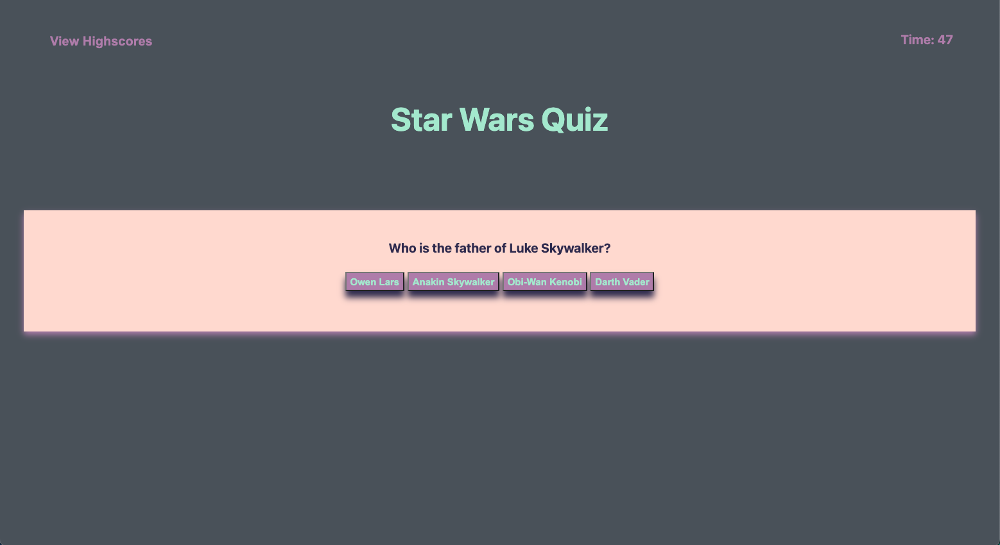

# Code Quiz

## Table of Contents

-[Screenshot](#ScreenShot) -[Description](#Description) -[Links](#Links)

## Screenshot 

## Description 

Challenge was to create an quiz that had a start button, multiple questions, and a timer that would record your initials and score at the end of the quiz. HTML, CSS, and Javascript files were created from scratch.

## Links 

-[Site Link](https://michael-alvarado.github.io/Star-Wars-Quiz/) -[Repository Link](https://github.com/Michael-Alvarado/Star-Wars-Quiz)
